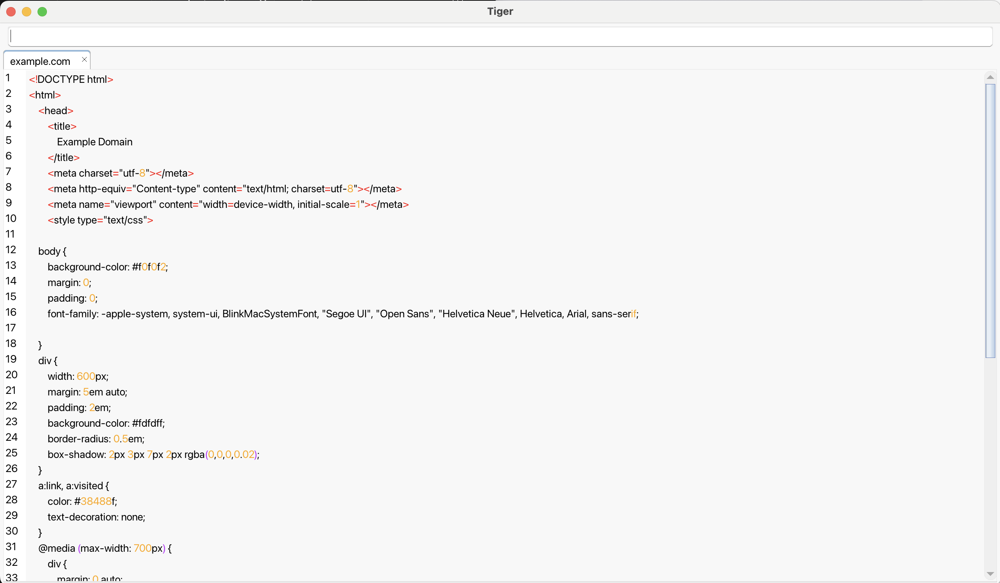

# Tiger

An attempt at creating a web browser in V following the [WhatWG spec](https://html.spec.whatwg.org/multipage/parsing.html).

This may not seem like much. This is actually the contents of example.com tokenized, parsed, constructed into a tree, then the source code for that DOM tree regenerated.

### Building
Tiger currently uses [pisaiah/ui](https://github.com/pisaiah/ui) for the UI. It can be installed with `v install` in the repository root.
After that you can build it as normal: `v run <repo_root>`.

#### Build Flags
These are flags the can be passed when building the app with `v -d <flag> run <repo_root>`
 Flag       | Description
------------|---------------
 print_tree | Pretty prints the DOM tree to the terminal. (Useful for debugging)